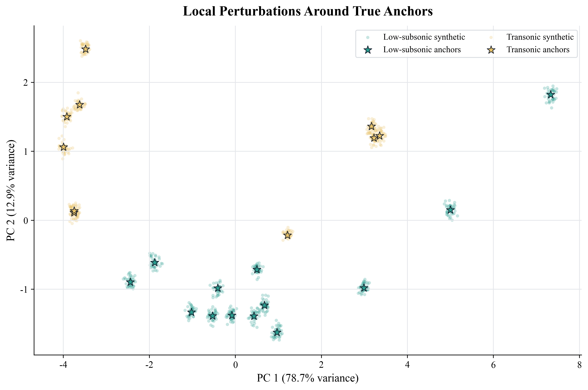

# 基于真实锚点微扰构造真标签翼型数据集的可行性验证

## 1. 结论

可以做，但只能在**局部、小半径、强锚点约束**下做。更准确地说：

> 可以从高可信真实锚点出发，在 19-mode 几何特征空间内生成“局部标签保持”的合成样本；这些样本可作为低速与跨音速真标签训练/验证数据的补充。但当前数据集中没有可用的强超音速真实锚点，因此不能凭空构造可信的 `Supersonic` 真标签样本。

本次脚本生成了：

- `Low-subsonic`: 520 个合成样本
- `Transonic`: 400 个合成样本
- `Supersonic`: 0 个合成样本

局部验证结果：

| 指标 | 结果 | 含义 |
|---|---:|---|
| same true-category neighborhood rate | 100.0% | 合成样本最近真实锚点仍属于同一真实类别 |
| source anchor nearest rate | 95.2% | 大多数合成样本最近锚点仍是其源锚点 |
| within real-manifold threshold rate | 100.0% | 合成样本没有明显离开当前 19-mode 数据流形 |

相关文件：

- 合成真标签数据：[anchor_perturbation_synthetic_labels.csv](../data/anchor_perturbation_synthetic_labels.csv)
- 验证摘要：[anchor_perturbation_validation_summary.csv](../data/anchor_perturbation_validation_summary.csv)
- 生成脚本：[generate_anchor_perturbation_dataset.py](../scripts/generate_anchor_perturbation_dataset.py)
- 可视化结果：

## 2. 文献依据与方法边界

### 2.1 为什么小扰动是合理的

航空气动优化中，翼型形状通常通过低维参数或局部扰动函数表达。Hicks-Henne bump functions 和 CST 方法都体现了一个基本思想：在受控参数空间内的小幅几何变化，通常可被视为同一设计族附近的连续形状变化。Kulfan 的 CST 方法尤其强调用少量参数描述翼型几何，适合进行低维形状建模和优化。

机器学习中的 SMOTE 也提供了类似思路：在同类样本局部邻域内生成合成样本，以增加带标签训练数据。这里不能直接照搬 SMOTE 到翼型问题，因为跨音速激波和波阻可能对几何扰动非常敏感；但它支持“在同类局部邻域内构造合成样本”的基本统计思想。

### 2.2 为什么不能任意扰动

翼型真实类别不是纯几何标签，而是设计任务、流动机制和气动响应共同决定的。特别是跨音速和超音速工况中，激波位置、阻力发散和波阻会对小几何变化较敏感。因此，扰动样本的标签只能在以下条件下认为可信：

1. 源锚点必须有权威真实类别来源。
2. 扰动半径必须小于到异类锚点边界的安全距离。
3. 扰动后仍需处在原始数据的 19-mode 几何流形附近。
4. 最终若用于气动性能建模，仍应通过 CFD 或实验数据复核关键样本。

## 3. 本次编码验证方案

脚本 `scripts/generate_anchor_perturbation_dataset.py` 使用如下流程：

1. 读取 `data/CST_19ML_clustered.csv` 中的 19 个 Mode。
2. 读取 `data/known_airfoil_references.csv` 中 `anchor_strength=strong` 的真实锚点。
3. 仅保留当前数据集中存在且 `quality_status=valid` 的强锚点。
4. 在所有有效翼型的 19-mode 空间内做鲁棒标准化。
5. 对每个锚点计算安全扰动半径：
   - 半径不超过“到最近异类强锚点距离”的 18%；
   - 同时不超过真实数据最近邻中位距离的 65%。
6. 在 19 维球体内均匀采样小扰动，生成合成 Mode。
7. 验证每个合成样本：
   - 最近真实锚点是否仍属于同一真实类别；
   - 最近真实锚点是否仍为源锚点；
   - 到最近真实翼型的距离是否小于真实数据最近邻距离的 95% 分位阈值。

这种方法不是在几何空间中任意加噪声，而是一个带边界检查的局部标签保持数据增强。

## 4. 实验结果

### 4.1 可用强锚点数量

当前数据集中可用强锚点为：

| 真实类别 | 强锚点数 | 是否可生成真标签扰动 |
|---|---:|---|
| Low-subsonic | 13 | 可以 |
| Transonic | 10 | 可以 |
| Supersonic | 0 | 不可以 |

这个结果非常关键：虽然我们在文献中知道 double-wedge、biconvex 等是超音速典型翼型，但它们没有作为明确命名样本存在于当前 19-mode 数据集中。因此，当前不能为 `Supersonic` 类生成真实标签扰动样本。

### 4.2 扰动样本验证结果

脚本生成 920 个合成样本，并通过三项几何邻域检查：

| 验证项 | 结果 |
|---|---:|
| 合成样本总数 | 920 |
| 同真实类别邻域保持率 | 100.0% |
| 源锚点最近率 | 95.2% |
| 真实数据流形内比例 | 100.0% |
| 合成样本到最近真实翼型距离中位数 | 0.286 |
| 合成样本到最近真实翼型距离 95% 分位 | 0.298 |
| 真实数据流形阈值 | 1.794 |

从几何邻域角度看，这些扰动是保守的，未明显越界。

## 5. 如何使用这个数据集

建议用途：

1. **训练一个初步的真标签分类器**  
   用 `anchor_perturbation_synthetic_labels.csv` 训练低速/跨音速二分类或开放集分类器。

2. **校准原有聚类标签**  
   将原始聚类结果与合成真标签邻域进行对比，识别明显偏离真实设计类别的区域。例如之前报告中，多个 AG 和 SD 系列低速翼型被当前速度偏好分类标为 `Supersonic`，这种情况可以被锚点扰动数据帮助纠正。

3. **作为主动学习种子集**  
   优先选择接近真实锚点边界、扰动后不稳定的样本做 CFD 复算或人工复核。

不建议用途：

1. 不应把这些合成样本当作真实 CFD 结果。
2. 不应把它们用于替代真实超音速翼型数据。
3. 不应在没有逆变换重构翼型坐标、几何合法性检查和 CFD 复算的情况下，用它们作为最终物理真值。

## 6. 下一步建议

为了构造完整三分类真标签数据集，建议按以下顺序推进：

1. **补充真实超音速翼型锚点**  
   从 double-wedge、biconvex、thin sharp-leading-edge airfoils 或公开超音速翼型坐标中引入样本。

2. **建立坐标到 19-mode 的投影工具**  
   目前我们只有已有翼型的 19-mode 系数。如果要加入外部超音速锚点，必须知道原始 mode basis，或重新用全数据集坐标训练 PCA/SVD/CST basis，然后把新翼型投影进去。

3. **加入几何合法性检查**  
   对扰动后的 Mode 反演几何，检查厚度、前缘半径、后缘夹角、上下表面交叉等。

4. **对边界样本做 CFD 验证**  
   对每一类选取低 margin 样本，重新计算 Ma=0.25、0.734、1.5 的气动响应，检查标签是否稳定。

5. **将标签拆成两层**  
   推荐区分：
   - `design_category`: 真实设计类别，例如 low-Re / transonic / supersonic；
   - `performance_preference`: 当前三工况下更偏好的 Mach 点。

这两类标签并不总是一致，混为一谈会导致模型解释错误。

## 7. 汇报时可用表述

> 我们尝试从真实锚点出发构造带真标签的数据集。根据航空形状优化和机器学习数据增强的文献，小幅几何扰动在局部邻域内可近似保持设计类别标签，但必须限制在异类锚点边界和真实数据流形内。我们实现了基于 19-mode 空间的局部扰动脚本，并生成 920 个合成样本。验证结果显示低速和跨音速样本的局部标签保持率为 100%，说明该思路对这两类是可行的。但当前数据集中没有强超音速真实锚点，所以不能构造可信超音速真标签数据。下一步需要引入 double-wedge、biconvex 等超音速典型翼型，并建立坐标到 19-mode 的投影方法。

## 8. 参考资料

1. Kulfan, B. M. Universal Parametric Geometry Representation Method, AIAA. CST 方法是翼型低维参数化和局部形状扰动的重要基础。<https://doi.org/10.2514/6.2006-6948>
2. Hicks, R. M. and Henne, P. A. Wing design by numerical optimization. Hicks-Henne bump functions 是经典局部翼型/机翼形状扰动方法。<https://doi.org/10.2514/3.753>
3. Chawla, N. V. et al. SMOTE: Synthetic Minority Over-sampling Technique. Journal of Artificial Intelligence Research, 2002. <https://doi.org/10.1613/jair.953>
4. UIUC Applied Aerodynamics Group, UIUC Airfoil Coordinates Database. <https://m-selig.ae.illinois.edu/ads/coord_database.html>
5. NASA Glenn Research Center, RAE2822 Transonic Airfoil Validation Archive. <https://www.grc.nasa.gov/www/wind/valid/raetaf/raetaf.html>
6. Harris, C. D. NASA Supercritical Airfoils: A Matrix of Family-Related Airfoils. NASA TP-2969, 1990. <https://ntrs.nasa.gov/citations/19900007394>
7. Van Dyke, M. D. Supersonic Flow Past Oscillating Airfoils Including Nonlinear Thickness Effects. NACA TN-2982, 1953. <https://ntrs.nasa.gov/citations/19930083707>
