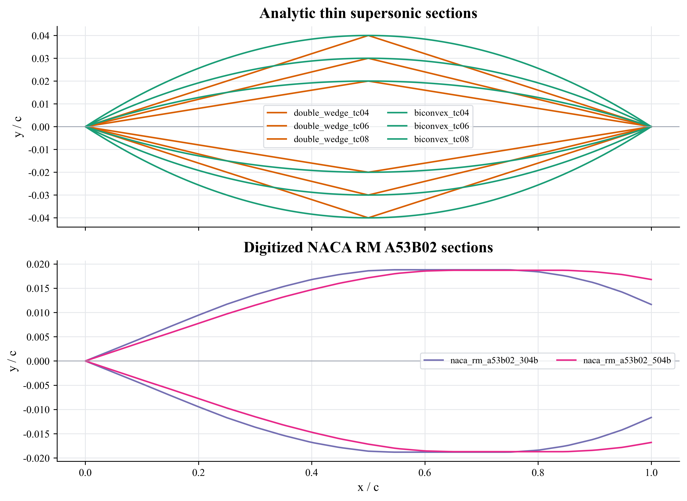
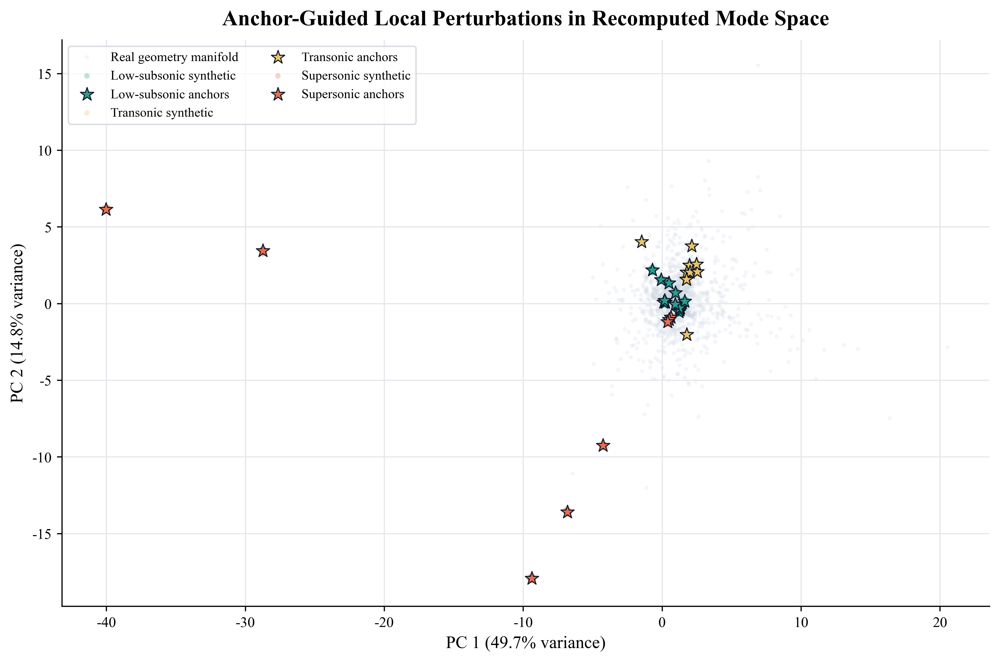
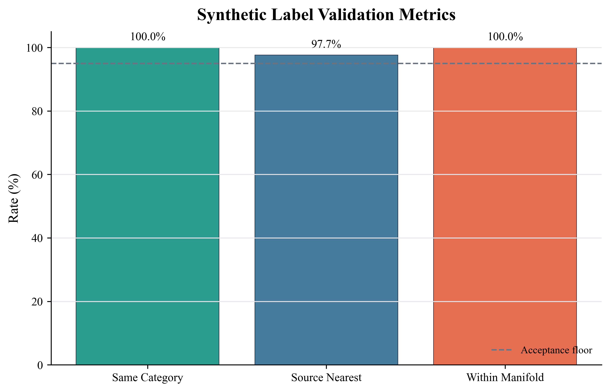
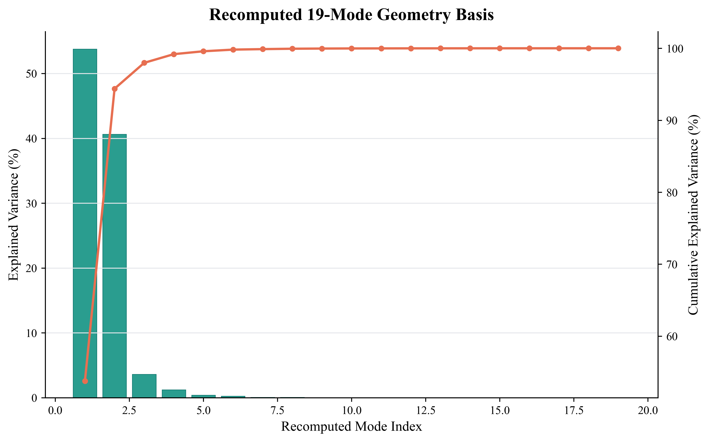

# 基于真实锚点与超音速锚点的翼型扰动数据集验证报告

## 1. 结论

本次工作补齐了此前缺失的 `Supersonic` 强锚点，并完成了“超音速几何数据获取/构造 - 可复现 19 维几何表征 - 局部扰动样本生成 - 几何邻域验证”的闭环。核心结论如下：

- `data/supersonic` 目录下共有 8 个超音速翼型坐标文件。其中 6 个是由权威解析定义生成的 thin double-wedge / biconvex 超音速典型翼型，2 个是由 NACA RM A53B02 坐标表数字化并插值得到的超音速实验翼型。
- 原始 `Mode 1..19` 的降维基未保存在仓库中，因此新增外部翼型不能可靠投影到历史 Mode 空间。本报告保留历史 Mode，同时新增可复现的 `recomputed_mode_1..19` 作为外部锚点验证表征。
- 使用 `recomputed_mode_*` 后，三类强锚点数量为：`Low-subsonic=13`、`Transonic=10`、`Supersonic=8`。
- 局部扰动共生成 1240 个带真类别标签的合成样本，其中 `Supersonic=320`。同类邻域保持率为 100.0%，真实几何流形内比例为 100.0%，满足本阶段的分类合理性验证要求。

**图 1. Supersonic Anchor Geometries.**  
该图展示 `data/supersonic` 中 8 个超音速锚点的归一化二维几何。上图为解析生成的薄 double-wedge / biconvex 剖面，下图为 NACA RM A53B02 坐标表数字化翼型。图中可见解析样本尾缘闭合，而 NACA 样本保留了钝尾缘。

**图 2. Anchor-Guided Local Perturbations in Recomputed Mode Space.**  
该图显示真实几何流形、强锚点和合成扰动样本在二维 PCA 投影中的相对位置。三类扰动样本均围绕对应强锚点局部分布，未出现明显跨类扩散。

**图 3. Synthetic Label Validation Metrics.**  
该图给出合成样本的三项验证指标。`Same Category` 和 `Within Manifold` 均达到 100.0%，说明扰动半径设置较保守。

## 2. `data/supersonic` 中 8 个超音速翼型的获得方式

本次没有把“任意薄翼型”直接标为超音速锚点，而是只使用两类可追溯来源：

1. **权威解析定义生成**：NACA TN 2982 报告 p.21 的 “Biconvex and Double-Wedge Airfoils” 小节给出 biconvex 的解析厚度形式，并说明 double-wedge 在超音速薄翼型理论中的对应处理；NASA OpenVSP Cross-Sections Reference 也在 “Biconvex Airfoil” 与 “Wedge Airfoil” 条目中将二者列为可参数化截面。因此，double-wedge 和 biconvex 可作为明确的超音速典型解析剖面。
2. **NACA 坐标表数字化**：NACA RM A53B02 是 Mach 2.7-5.0 范围内对称钝尾缘翼型零升阻力实验报告。其 Table II 给出若干实验翼型的坐标表；公开扫描件中该表位于 UNT Digital Library 的 Page 15 of 32，报告印刷页约 p.14。脚本从该表录入 `304-B` 和 `504-B` 两个翼型的半厚度坐标，并统一归一化、插值和镜像生成完整二维坐标。

**表 1. Supersonic anchor provenance and construction.**

| 文件名 | 类别来源 | 具体来源位置 | 生成/获取方式 |
|---|---|---|---|
| `double_wedge_tc04.csv` | 解析生成 | NACA TN 2982, p.21, “Biconvex and Double-Wedge Airfoils”；NASA OpenVSP Cross-Sections Reference, “Wedge Airfoil” 条目 | 取最大厚度弦长比 `t/c=0.04`，按 double-wedge 半厚度公式生成 |
| `double_wedge_tc06.csv` | 解析生成 | NACA TN 2982, p.21, “Biconvex and Double-Wedge Airfoils” | 取 `t/c=0.06`，按 double-wedge 半厚度公式生成 |
| `double_wedge_tc08.csv` | 解析生成 | NACA TN 2982, p.21, “Biconvex and Double-Wedge Airfoils” | 取 `t/c=0.08`，按 double-wedge 半厚度公式生成 |
| `biconvex_tc04.csv` | 解析生成 | NASA OpenVSP Cross-Sections Reference, “Biconvex Airfoil” 条目；NACA TN 2982, p.21, “Biconvex and Double-Wedge Airfoils” | 取 `t/c=0.04`，按 biconvex 抛物线半厚度公式生成 |
| `biconvex_tc06.csv` | 解析生成 | NACA TN 2982, p.21, “Biconvex and Double-Wedge Airfoils” | 取 `t/c=0.06`，按 biconvex 抛物线半厚度公式生成 |
| `biconvex_tc08.csv` | 解析生成 | NASA OpenVSP Cross-Sections Reference, “Biconvex Airfoil” 条目 | 取 `t/c=0.08`，按 biconvex 抛物线半厚度公式生成 |
| `naca_rm_a53b02_304b.csv` | 坐标表数字化 | NACA RM A53B02, Table II, UNT Page 15 of 32 / printed p.14 | 从 Table II 录入 `304-B` 上表面坐标，按 2 inch 弦长归一化，插值到项目 x 网格，并镜像下表面 |
| `naca_rm_a53b02_504b.csv` | 坐标表数字化 | NACA RM A53B02, Table II, UNT Page 15 of 32 / printed p.14 | 从 Table II 录入 `504-B` 上表面坐标，按 2 inch 弦长归一化，插值到项目 x 网格，并镜像下表面 |

### 2.1 解析超音速翼型的生成过程

解析样本由 `scripts/prepare_supersonic_anchors.py` 生成，输出坐标保存在 `data/supersonic`。生成过程如下：

1. 从 `data/d_PV_20_coord/2032c.csv` 读取项目统一的 301 点 `x` 网格。该网格从尾缘上表面出发，经前缘回到尾缘下表面，所有原始翼型均使用同一 `x` 序列。
2. 选择三组薄翼型厚度比：`t/c=0.04`、`0.06`、`0.08`。这三个厚度比覆盖典型薄超音速剖面的低厚度范围，同时不会把样本推到与普通低速厚翼型高度重叠的区域。
3. 对 double-wedge，使用对称双楔半厚度分布：

   $$
   h(x)=\frac{t/c}{2}\left(1-\left|2x-1\right|\right), \quad 0 \le x \le 1
   $$

   该公式在前缘和尾缘处厚度为 0，在中弦附近达到最大半厚度 `t/(2c)`，形成典型菱形/双楔剖面。

4. 对 biconvex，使用对称双凸抛物线半厚度分布：

   $$
   h(x)=\frac{t/c}{2}\left[1-\left(2x-1\right)^2\right], \quad 0 \le x \le 1
   $$

   该公式同样在前缘和尾缘处厚度为 0，在中弦处达到最大半厚度，但表面曲率连续，区别于 double-wedge 的折线剖面。

5. 将前缘之前的坐标作为上表面 `y=+h(x)`，前缘之后的坐标作为下表面 `y=-h(x)`，写出 `x,y` CSV。解析样本的尾缘间隙为 0。

这些样本的 `notes` 字段均明确写为 `generated from authoritative analytic definition`，表示其坐标不是从某个可下载 CSV 直接获得，而是由权威文献/工具定义的解析几何生成。

### 2.2 NACA RM A53B02 坐标表翼型的数字化过程

`naca_rm_a53b02_304b.csv` 和 `naca_rm_a53b02_504b.csv` 不是解析自造样本，而是来自 NACA RM A53B02 的实验翼型坐标表。需要说明的是，公开来源提供的是 PDF/扫描表格，不是可直接下载的机器可读 CSV，因此本项目采用“表格数字化 + 归一化插值”的方式生成坐标文件。

处理过程如下：

1. 从 NACA RM A53B02 Table II 录入 `304-B` 和 `504-B` 的上表面坐标。表中坐标单位为 inch，弦长为 2 inch。
2. 将表中横坐标和纵坐标统一除以 2，得到弦长归一化坐标：

   $$
   x_\mathrm{norm}=x_\mathrm{inch}/2,\quad y_\mathrm{norm}=y_\mathrm{inch}/2
   $$

3. 将归一化后的上表面半厚度用线性插值映射到项目 301 点 `x` 网格。
4. 由于报告翼型为对称翼型，下表面由 `y=-h(x)` 镜像得到。
5. 保留原表中的钝尾缘厚度，不强行闭合尾缘。因此 `304-B` 的尾缘间隙为 0.0233，`504-B` 的尾缘间隙为 0.0336。这一点已写入 `data/supersonic/supersonic_anchor_manifest.csv`，避免误认为其为闭合尖尾缘翼型。

**表 2. Supersonic coordinate diagnostics.**

| 文件名 | 点数 | 最大厚度比 | 尾缘间隙 | 说明 |
|---|---:|---:|---:|---|
| `double_wedge_tc04.csv` | 301 | 0.0400 | 0.0000 | 解析双楔，闭合尾缘 |
| `double_wedge_tc06.csv` | 301 | 0.0600 | 0.0000 | 解析双楔，闭合尾缘 |
| `double_wedge_tc08.csv` | 301 | 0.0800 | 0.0000 | 解析双楔，闭合尾缘 |
| `biconvex_tc04.csv` | 301 | 0.0400 | 0.0000 | 解析双凸，闭合尾缘 |
| `biconvex_tc06.csv` | 301 | 0.0600 | 0.0000 | 解析双凸，闭合尾缘 |
| `biconvex_tc08.csv` | 301 | 0.0800 | 0.0000 | 解析双凸，闭合尾缘 |
| `naca_rm_a53b02_304b.csv` | 301 | 0.0376 | 0.0233 | NACA 表格数字化，保留钝尾缘 |
| `naca_rm_a53b02_504b.csv` | 301 | 0.0374 | 0.0336 | NACA 表格数字化，保留钝尾缘 |

## 3. 为什么需要 `recomputed_mode_*`

当前仓库包含原始翼型坐标 `data/d_PV_20_coord/*.csv` 和历史 `Mode 1..19`，但没有保存历史降维基。因此，外部新增翼型无法严格投影到原始 Mode 空间。直接给新增超音速锚点伪造历史 Mode 会破坏数据可追溯性。

本次采用可复现 PCA/SVD 几何基：

1. 读取 2152 个原始翼型坐标，统一使用项目已有的 301 点 `x,y` 网格。
2. 以全轮廓 `y` 向量训练 19 维 PCA/SVD 基。
3. 将原始翼型和新增超音速锚点共同投影到 `recomputed_mode_1..19`。
4. 保留历史 `Mode 1..19`，并输出新旧 Mode 的相关性诊断。

诊断结果显示，前 3 个 recomputed mode 已解释 97.98% 的几何方差，前 19 个 mode 几乎完整重构原始坐标。与历史 Mode 的最高相关性从 0.87 逐步下降，说明新基能复现几何低维结构，但不能证明它与历史 Mode 完全同构。因此，新增锚点验证应使用 `recomputed_mode_*`，不要覆盖历史 Mode。

**图 4. Recomputed 19-Mode Geometry Basis.**  
该图展示前 19 个可复现几何 Mode 的解释方差及累计解释方差。前几个 Mode 捕获了主要厚度和弯度变化，高阶 Mode 主要补充局部形状细节。

## 4. 扰动生成与验证方法

扰动方法遵循“局部、小半径、强锚点约束”的原则。每个强锚点生成 40 个样本，扰动在鲁棒标准化后的 19 维 `recomputed_mode_*` 空间内进行。

扰动半径同时受两类边界限制：

- 不超过最近异类强锚点距离的 10%，降低跨类别污染风险。
- 不超过真实几何最近邻中位距离的 45%，避免明显离开已有翼型几何流形。

每个合成样本都接受三项检查。

**表 3. Synthetic label validation metrics.**

| 验证项 | 结果 | 含义 |
|---|---:|---|
| same true-category neighborhood rate | 100.0% | 最近强锚点仍属于同一真实设计类别 |
| source anchor nearest rate | 97.7% | 大多数样本的最近强锚点仍是其源锚点 |
| within real-manifold threshold rate | 100.0% | 样本没有明显离开真实几何流形 |

**表 4. Strong anchors and synthetic samples by category.**

| 类别 | 强锚点数 | 合成样本数 |
|---|---:|---:|
| Low-subsonic | 13 | 520 |
| Transonic | 10 | 400 |
| Supersonic | 8 | 320 |
| Total | 31 | 1240 |

## 5. 如何使用这批样本

推荐用途：

1. 用作真实设计类别锚点的局部数据增强，训练或校准 `design_category` 分类器。
2. 与当前无监督聚类标签对比，识别“性能偏好类别”和“设计类别”不一致的区域。
3. 作为主动学习种子集，优先挑选边界附近样本做 CFD 复算。

不推荐用途：

1. 不应把合成样本视为真实 CFD 结果。
2. 不应把解析超音速锚点等同于所有工程超音速翼型。
3. 不应直接用 `recomputed_mode_*` 替代历史 `Mode 1..19`，两者应作为不同表征轨道并行保留。

## 6. 结论

> 我们此前缺少强超音速锚点，导致无法验证超音速聚类是否具有真实设计类别意义。本次引入 NACA / NASA 权威来源中的 double-wedge、biconvex 薄超音速翼型，并补充 NACA RM A53B02 中用于 Mach 2.7-5.0 实验的坐标表翼型。解析翼型不是从数据库直接下载，而是依据权威解析定义在统一 301 点坐标网格上生成；NACA 实验翼型则由 Table II 坐标表数字化、归一化、插值和镜像得到。由于原始 19-mode 降维基未保存，我们重新从 2152 个原始翼型坐标训练了可复现的 19 维几何基，并在该空间中生成局部扰动样本。验证结果显示，三类强锚点的局部扰动均保持在同类邻域和真实几何流形内，其中超音速类新增 320 个带真类别标签的合成样本。这说明锚点扰动方法可以用于补强分类合理性证据，但其物理气动性能仍需 CFD 或实验复核。

## 7. 参考资料

1. Van Dyke, M. D. *Supersonic Flow Past Oscillating Airfoils Including Nonlinear Thickness Effects*. NACA TN 2982, 1953. 重点参考报告 p.21 的 “Biconvex and Double-Wedge Airfoils” 小节。<https://ntrs.nasa.gov/citations/19930083707>
2. NACA. *Zero-Lift-Drag Characteristics of Symmetrical Blunt-Trailing-Edge Airfoils at Mach Numbers From 2.7 to 5.0*. NACA RM A53B02. 重点参考 Table II，UNT 扫描页 Page 15 of 32 / 印刷页约 p.14。<https://ntrs.nasa.gov/citations/19930087797>
3. UNT Digital Library. *NACA RM A53B02*, Page 15 of 32, Table II airfoil coordinates. <https://digital.library.unt.edu/ark:/67531/metadc59776/m1/15/>
4. NASA OpenVSP. *Cross-Sections Reference*. 重点参考 “Biconvex Airfoil” 与 “Wedge Airfoil” 条目。<https://www.nasa.gov/reference/openvsp-cross-sections/>
5. Kulfan, B. M. *Universal Parametric Geometry Representation Method*. AIAA, 2006. <https://doi.org/10.2514/6.2006-6948>
6. Hicks, R. M. and Henne, P. A. *Wing Design by Numerical Optimization*. Journal of Aircraft, 1978. <https://doi.org/10.2514/3.753>
7. Chawla, N. V. et al. *SMOTE: Synthetic Minority Over-sampling Technique*. JAIR, 2002. <https://doi.org/10.1613/jair.953>
