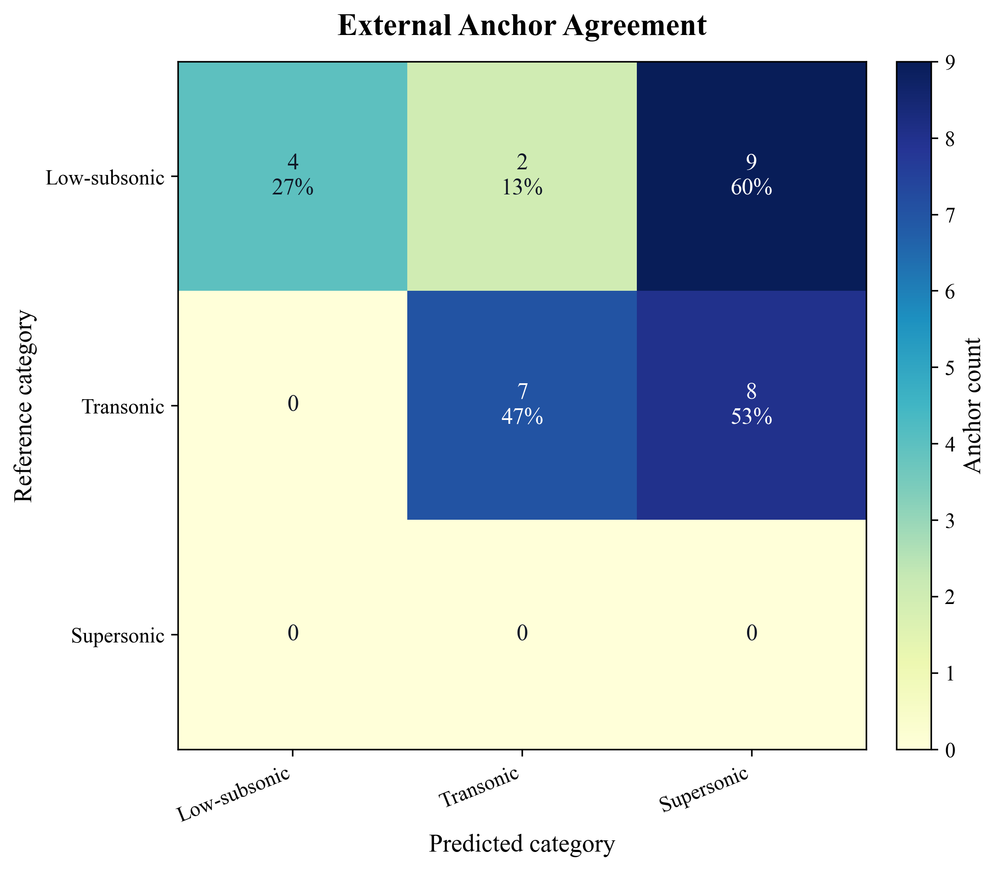
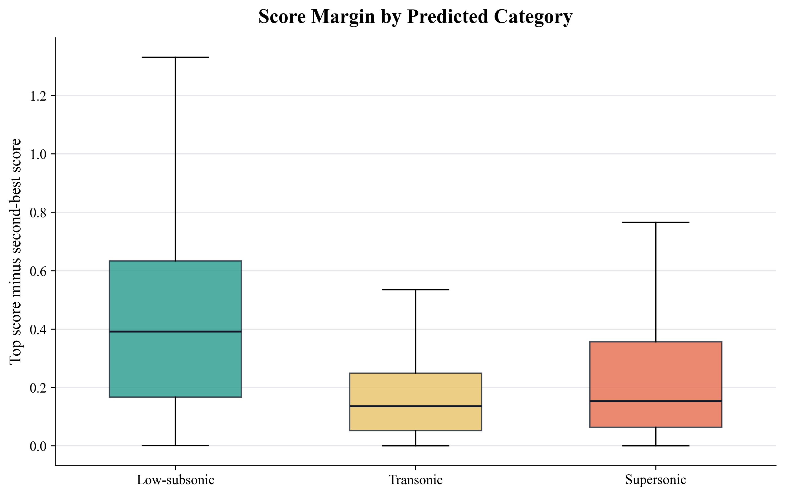

# 翼型速度工况分类结果有效性验证报告

## 1. 为什么必须做外部验证

无监督聚类本身只保证“数据在当前特征空间中被分开”，不保证簇名具有工程语义。经典聚类验证研究通常要求同时考虑：

1. **内部有效性**：类内是否紧凑、类间是否分离。Rousseeuw 提出的 silhouette 思想就是用于判断样本是清晰落在某簇内，还是处于簇边界。
2. **外部有效性**：若存在部分真实标签，应检查聚类标签与参考标签的一致性，例如 Adjusted Rand Index、混淆矩阵或锚点一致率。
3. **物理一致性**：翼型类别应与已知流动机制一致。例如低速翼型通常关注高升力、低速失速和低雷诺数层流分离；跨音速/超临界翼型关注激波、阻力发散和后加载；超音速翼型通常更薄、前缘更尖，并受激波/膨胀波和波阻主导。

因此，单纯看 PCA 分布或三类数量不够。必须引入真实翼型锚点和物理判据。

## 1. 结论

当前 `Low-subsonic / Transonic / Supersonic` 三类结果**可以解释为在 Ma=0.25、Ma=0.734、Ma=1.5 三个 CFD 工况下的相对性能偏好分组**，但还**不能直接解释为翼型历史设计意图或真实工程类别**。

主要原因是：外部真实翼型锚点验证显示，30 个可比锚点中仅 11 个与当前聚类标签一致，一致率为 **36.7%**；其中 `strong` 级别锚点一致率为 **43.5%**。这说明当前方法能够捕捉某些跨音速典型翼型，例如 RAE 2822、Whitcomb、NASA SC(2) 系列，但会把不少低雷诺数/模型飞机翼型分到 `Supersonic`。因此，在正式汇报中建议把当前结果表述为：

> 当前分类是“基于三组给定工况气动响应的速度偏好标签”，不是已经完成验证的“真实翼型设计类别标签”。

相关输出文件：

- 外部锚点表：[known_airfoil_references.csv](../data/known_airfoil_references.csv)
- 锚点对比结果：[known_airfoil_reference_comparison.csv](../data/known_airfoil_reference_comparison.csv)
- 验证脚本：[validate_cluster_results.py](../scripts/validate_cluster_results.py)

## 3. 外部锚点来源

本次建立了一个小型锚点库，将文献或权威数据库中明确描述的翼型作为参考标签：

- **低速/低雷诺数锚点**：UIUC Airfoil Coordinates Database 明确列出大量 Selig、Selig/Donovan、Drela AG 等低雷诺数翼型。例如 SD7037、SD7062、S2048、S2050 被标注为 low Reynolds number airfoil；AG24-AG27 被标注为 Bubble Dancer R/C DLG 用翼型。
- **跨音速锚点**：NASA Glenn 的 RAE 2822 验证算例明确是 transonic flow，工况 Ma=0.725、Re=6.5 million、迎角 2.92 deg，与本项目 Ma=0.734、Re=6.5E+6 的跨音速工况高度接近。UIUC 数据库也将 RAE 2822、RAE 5212-5215、RAE6-9CK 标为 transonic airfoil。NASA TP-2969 给出了 NASA supercritical airfoil family，SC(2) 系列应作为跨音速/超临界锚点。
- **超音速锚点**：权威 NACA/NASA 文献中，double-wedge 与 biconvex 是典型超音速理论翼型。但当前数据集中没有明确命名的 double-wedge 或 biconvex 样本，因此本项目目前缺少高可信度的“真实超音速设计翼型”外部锚点。

## 4. 验证结果

### 4.1 外部锚点一致性

可比锚点统计如下：

- strong 表示来源明确把该翼型称为低雷诺数/跨音速/超临界等；
- contextual 表示多用途或旋翼高马赫翼型；
- archetype 表示文献中的超音速典型形状但当前数据集中没有对应名称。

| 锚点级别 | 可比数量 | 一致数量 | 一致率 |
|---|---:|---:|---:|
| strong | 23 | 10 | 43.5% |
| contextual | 7 | 1 | 14.3% |
| all comparable | 30 | 11 | 36.7% |

主要一致样本：

- `rae2822 -> Transonic`：与 NASA Glenn RAE 2822 transonic validation case 一致。
- `whitcomb -> Transonic`：与 NASA/Langley Whitcomb integral supercritical airfoil 一致。
- `sc20412 / sc20414 / sc21010 -> Transonic`：与 NASA SC(2) supercritical family 一致。
- `2032c / e423 / sd7062 -> Low-subsonic`：与低雷诺数或高升力低速翼型锚点一致。

主要不一致样本：

- `ag03 / ag24 / ag25 / ag26 / ag27` 被分到 `Supersonic`，但它们在 UIUC 数据库中属于 Drela AG 低速模型飞机翼型家族。
- `s2048 / s2050 / sd7032 / sd7037 / sd7080` 被分到 `Transonic` 或 `Supersonic`，但 UIUC 将其列为低雷诺数翼型。
- `rae5213 / rae5214 / rae5215` 被分到 `Supersonic`，但 UIUC 将其列为 transonic airfoil。
- `ames01 / ames02 / ames03 / ssca07 / ssca09` 被分到 `Supersonic`，但它们更接近 transonic rotorcraft airfoil 或多工况旋翼翼型。

这一结果说明：当前分类中 `Supersonic` 类混入了大量“在 Ma=1.5 工况相对表现较好”的低速或跨音速翼型。它们未必是真正为超音速流动设计的翼型。

### 4.2 内部稳定性

这里定义 `score margin = 最高工况得分 - 次高工况得分`。它衡量一个翼型被分到某一类的稳定程度：margin 越大，说明该翼型明显偏向某个工况；margin 越小，说明它位于类别边界附近。

| 当前类别 | 中位数 margin | 10% 分位 margin | 解释 |
|---|---:|---:|---|
| Low-subsonic | 0.392 | 0.067 | 低速类内部相对稳定 |
| Transonic | 0.136 | 0.011 | 很多样本接近边界 |
| Supersonic | 0.153 | 0.021 | 部分样本只是弱偏向 Ma=1.5 |

内部稳定性结果与外部锚点结果一致：低速类相对更稳定，而跨音速和 Ma=1.5 偏好类之间存在较明显的边界混淆。

## 5. 当前方法为什么会产生偏差

当前分类使用的是三个工况下的 `Cd`、`Cl` 和 `L/D` 组合分数。这个设计适合回答：

> 在这三个固定 CFD 工况中，该翼型更偏向哪一个速度点？

但它不完全等价于：

> 该翼型在历史设计意图上属于低音速、跨音速还是超音速？

偏差来源包括：

1. **类别定义不同**  
   低速/跨音速/超音速“设计类别”是由几何、流动机制和设计任务共同决定的；当前标签主要由三个离散工况下的气动系数决定。

2. **Ma=1.5 标签过于宽泛**  
   一个低速翼型在 Ma=1.5 的 `Cl/Cd` 相对分数较高，不代表它具备超音速翼型应有的薄翼、尖前缘、低波阻等设计特征。

3. **缺少真实超音速锚点**  
   当前数据集主要来自常见二维翼型库，低速和跨音速翼型较多，但没有明确的 double-wedge、biconvex 等超音速理论翼型锚点。因此 `Supersonic` 类目前缺少外部真值支撑。

4. **仅使用单迎角和单雷诺数**  
   本项目工况固定为 `α=2.832 deg, Re=6.5E+6`。真实适用速度范围通常需要 Mach sweep、迎角 sweep、失速特性、阻力发散 Mach 数和激波行为共同判断。

## 6. 如何让分类结果更可信

建议将验证流程升级为四层证据链：

### 6.1 明确标签语义

短期内建议把当前标签改写为：

- `Ma0.25-preferred`
- `Ma0.734-preferred`
- `Ma1.5-preferred`

在展示中可说明它们分别对应低速、跨音速、超音速候选区域，但不要直接称为真实设计类别。

### 6.2 扩充外部锚点库

继续补充三类强锚点，尤其是超音速类：

- 低速：Selig、Selig/Donovan、Drela AG、Wortmann FX 等低雷诺数/滑翔机/模型飞机翼型。
- 跨音速：RAE 2822、RAE 5212-5215、NASA SC(2)、Whitcomb supercritical、典型 transonic rotorcraft airfoils。
- 超音速：double-wedge、biconvex、thin sharp-leading-edge supersonic sections，并将其坐标投影到当前 19-mode 表征空间。

只有当每一类都有足够的强锚点，外部一致率才有解释力。

### 6.3 加入几何判据

仅靠 `Cd/Cl` 不足以判定真实类别。建议从原始翼型坐标或 CST 表征恢复以下几何量：

- 最大厚度 `t/c`
- 最大厚度位置
- 最大弯度与弯度位置
- 前缘半径
- 后缘楔角
- 上表面平坦程度或后加载特征

超音速翼型应更强调薄翼和尖前缘；跨音速超临界翼型应更强调上表面平坦、后加载和较弱激波；低速翼型则常有较强弯度和高升力设计。

### 6.4 做稳定性和灵敏度检验

建议固定一个报告标准：

- 外部 strong 锚点一致率目标：`>= 80%`
- 每类 strong 锚点数量：`>= 5`
- 每类 median margin：`> 0.10`
- 每类 10% 分位 margin：`> 0.02`
- 对 `Cd/Cl` 加入小扰动或 bootstrap 后，标签保持率：`>= 90%`

当前结果尚未达到外部锚点一致率要求，因此只能作为初步分组。

## 7. 结论

首先基于三组可信 CFD 工况构造了速度偏好标签，并生成了三类候选翼型。随后引入 UIUC、NASA Glenn、NASA TP 和 NACA 文献中的真实翼型作为外部锚点进行验证。结果显示，RAE 2822、Whitcomb、NASA SC(2) 等典型跨音速翼型被正确分到跨音速类，说明方法能捕捉部分高马赫跨音速特征；但 Drela AG、Selig/Donovan 等低速翼型有较多被分入 Ma=1.5 偏好类，说明当前标签仍主要反映“给定三工况下的相对气动表现”，不能直接等同于翼型真实设计类别。下一步需要加入真实超音速锚点和几何判据，形成外部锚点、内部稳定性和物理机制三重验证闭环。

## 8. 参考资料

1. NASA Glenn Research Center, RAE2822 Transonic Airfoil Validation Archive. The validation case uses Ma=0.725, Re=6.5 million and angle of attack 2.92 deg, close to this project’s Ma=0.734 case. <https://www.grc.nasa.gov/www/wind/valid/raetaf/raetaf.html>
2. UIUC Applied Aerodynamics Group, UIUC Airfoil Coordinates Database. The database contains about 1650 airfoils and labels many low Reynolds number, transonic and supercritical sections. <https://m-selig.ae.illinois.edu/ads/coord_database.html>
3. Harris, C. D. NASA Supercritical Airfoils: A Matrix of Family-Related Airfoils. NASA TP-2969, 1990. <https://ntrs.nasa.gov/citations/19900007394>
4. Van Dyke, M. D. Supersonic Flow Past Oscillating Airfoils Including Nonlinear Thickness Effects. NACA TN-2982, 1953. <https://ntrs.nasa.gov/citations/19930083707>
5. Rousseeuw, P. J. Silhouettes: A Graphical Aid to the Interpretation and Validation of Cluster Analysis. Journal of Computational and Applied Mathematics, 1987. DOI: 10.1016/0377-0427(87)90125-7.
6. Hubert, L. and Arabie, P. Comparing Partitions. Journal of Classification, 1985. This is the classical basis of adjusted Rand index style external cluster validation.
